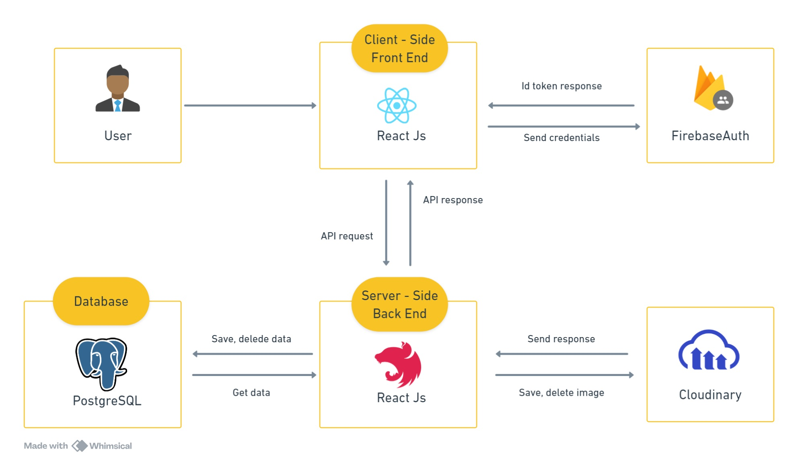
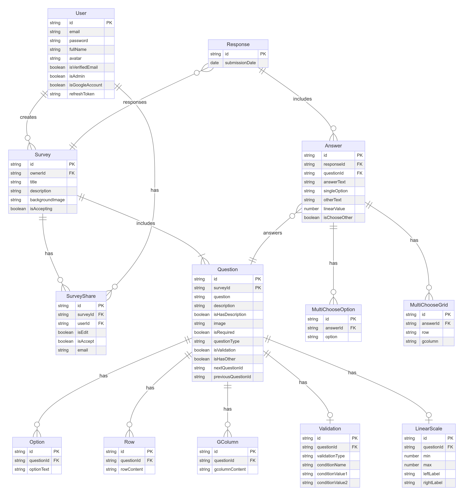

# GSURVEY - WEB SURVEY

## Description

The GSurvey website is designed to help users quickly create a basic survey. The survey includes multiple questions, each of which can have different types of responses such as text, single choice, multiple choice, multichoice grid, and linear scale.

## Architechture Diagram

## Database Diagram

## Directory Structure

### Fe:

📦GForm
┣ 📂public
┃ ┣ 📜favicon.ico
┃ ┣ 📜index.html
┃ ┗ ...
┣ 📂src
┃ ┣ 📂API
┃ ┃ ┗ 📜axios.ts
┃ ┣ 📂assets
┃ ┃ ┗ 📂images
┃ ┃ ┃ ┣ 📜example1.jpg
┃ ┃ ┃ ┣ 📜example2.png
┃ ┃ ┃ ┗ ...
┃ ┣ 📂components
┃ ┃ ┣ 📂ExampleComponent
┃ ┃ ┃ ┣ 📜example-component.module.scss
┃ ┃ ┃ ┣ 📜ExampleComponent.tsx
┃ ┃ ┃ ┗ 📜index.tsx
┃ ┃ ┣ ...
┃ ┃ ┗ 📜index.ts
┃ ┣ 📂config
┃ ┃ ┣ 📜i18n.ts
┃ ┃ ┣ 📜sentry.ts
┃ ┃ ┣ 📜firebase.ts
┃ ┃ ┗ 📜index.ts
┃ ┣ 📂constants
┃ ┃ ┣ 📜chart-color.ts
┃ ┃ ┣ 📜language.ts
┃ ┃ ┗ 📜index.ts
┃ ┣ 📂hooks
┃ ┃ ┗ 📂api-hooks
┃ ┃ ┃ ┣ 📂mutations
┃ ┃ ┃ ┃ ┣ 📜useExampleMutation.ts
┃ ┃ ┃ ┃ ┣ ...
┃ ┃ ┃ ┃ ┗ 📜index.ts
┃ ┃ ┃ ┗ 📂queries
┃ ┃ ┃ ┃ ┣ 📜useExampleQuery.ts
┃ ┃ ┃ ┃ ┣ ...
┃ ┃ ┃ ┃ ┗ 📜index.ts
┃ ┃ ┣ 📜useAutoSave.tsx
┃ ┃ ┣ 📜useDebounce.tsx
┃ ┃ ┗ 📜index.tsx
┃ ┣ 📂layouts
┃ ┃ ┣ 📂ExampleLayout
┃ ┃ ┃ ┣ 📂components
┃ ┃ ┃ ┃ ┣ 📂ExampleComponent
┃ ┃ ┃ ┃ ┃ ┣ 📜example-component.module.scss
┃ ┃ ┃ ┃ ┃ ┣ 📜ExampleComponent.tsx
┃ ┃ ┃ ┃ ┃ ┗ 📜index.tsx
┃ ┃ ┃ ┃ ┗ ...
┃ ┃ ┃ ┣ 📜example-layout.module.scss
┃ ┃ ┃ ┣ 📜ExampleLayout.tsx
┃ ┃ ┃ ┗ 📜index.tsx
┃ ┃ ┗ 📜index.ts
┃ ┣ 📂locales
┃ ┃ ┣ 📂en
┃ ┃ ┃ ┣ 📜auth.json
┃ ┃ ┃ ┣ ...
┃ ┃ ┃ ┗ 📜index.ts
┃ ┃ ┗ 📂vi
┃ ┃ ┃ ┣ 📜auth.json
┃ ┃ ┃ ┣ ...
┃ ┃ ┃ ┗ 📜index.ts
┃ ┣ 📂pages
┃ ┃ ┣ 📂ExamplePage
┃ ┃ ┃ ┣ 📂containers
┃ ┃ ┃ ┃ ┣ 📂ExampleContainer
┃ ┃ ┃ ┃ ┃ ┣ 📜example-container.module.scss
┃ ┃ ┃ ┃ ┃ ┣ 📜ExampleContainer.tsx
┃ ┃ ┃ ┃ ┃ ┗ 📜index.tsx
┃ ┃ ┃ ┃ ┗ ...
┃ ┃ ┃ ┣ 📂components
┃ ┃ ┃ ┃ ┣ 📂ExampleComponent
┃ ┃ ┃ ┃ ┃ ┣ 📜example-component.module.scss
┃ ┃ ┃ ┃ ┃ ┣ 📜ExampleComponent.tsx
┃ ┃ ┃ ┃ ┃ ┗ 📜index.tsx
┃ ┃ ┃ ┃ ┗ ...
┃ ┃ ┃ ┣ 📜example-page.module.scss
┃ ┃ ┃ ┣ 📜ExamplePage.tsx
┃ ┃ ┃ ┗ 📜index.tsx
┃ ┃ ┣ ...
┃ ┃ ┗ 📜index.ts
┃ ┣ 📂redux
┃ ┃ ┣ 📂slice
┃ ┃ ┃ ┣ 📜auth.ts
┃ ┃ ┃ ┣ ...
┃ ┃ ┃ ┗ 📜index.ts
┃ ┃ ┗ 📜store.ts
┃ ┣ 📂routes
┃ ┃ ┣ 📂page-routers
┃ ┃ ┃ ┣ 📜AuthRouter.tsx
┃ ┃ ┃ ┣ 📜ProtectedRouter.tsx
┃ ┃ ┃ ┗ 📜index.ts
┃ ┃ ┗ 📜router.tsx
┃ ┣ 📂stories
┃ ┃ ┣ 📜MyButton.stories.tsx
┃ ┃ ┗ 📜NormalTextInput.stories.tsx
┃ ┣ 📂utils
┃ ┃ ┣ 📂axios
┃ ┃ ┃ ┗ 📜instance-axios.ts
┃ ┃ ┣ 📂interfaces
┃ ┃ ┃ ┣ 📜IQuestion.ts
┃ ┃ ┃ ┣ ...
┃ ┃ ┃ ┗ 📜index.ts
┃ ┃ ┣ 📜convert-date.ts
┃ ┃ ┗ ...
┃ ┣ 📜App.test.tsx
┃ ┣ 📜App.tsx
┃ ┣ 📜index.scss
┃ ┣ 📜index.tsx
┃ ┣ 📜logo.svg
┃ ┣ 📜react-app-env.d.ts
┃ ┣ 📜reportWebVitals.ts
┃ ┣ 📜setupTests.ts
┃ ┗ 📜variable.scss
┣ 📜.env
┣ 📜.env.example
┣ 📜.eslintrc.json
┣ 📜.gitignore
┣ 📜.prettierrc
┣ 📜package-lock.json
┣ 📜package.json
┣ 📜README.md
┗ 📜tsconfig.json

### Be:

## Install and Run the Project

### Add .env file

Add the .env file to the root directory with the parameters as described in the .env.example file.

### `npm install`

The `npm install` command is used to install the packages and dependencies listed in the project's package.json file.

### `npm start`

Run command `npm start` to start project.
